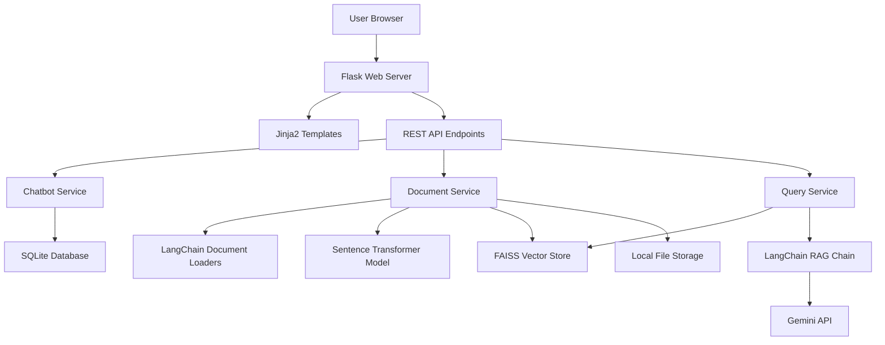

# Design Document: RAG Chatbot Platform

## Overview

The RAG Chatbot Platform is a Flask-based web application that enables users to create custom chatbots trained on their own documents. The system uses a hybrid approach: local Sentence Transformer models for embedding generation and Google's Gemini API for LLM-powered responses. LangChain orchestrates the RAG pipeline, providing document loading, vector storage, and retrieval capabilities.

The platform follows a simple 4-step workflow:
1. **Basic Settings**: Configure chatbot name and system prompt
2. **Data Upload**: Upload training documents (PDF, TXT, DOCX)
3. **Preview & Test**: Test the chatbot before deployment
4. **Deploy**: Make the chatbot live and accessible

## Architecture

### High-Level Architecture



### Technology Stack

**Backend:**
- Flask (Python web framework)
- LangChain (RAG orchestration)
- Sentence Transformers (local embedding model)
- Google Gemini API (LLM responses)
- FAISS (vector similarity search)
- SQLite (metadata storage)

**Frontend:**
- HTML/CSS/JavaScript
- Jinja2 templates
- Fetch API for async requests

**Document Processing:**
- PyPDF2 or pdfplumber (PDF parsing)
- python-docx (DOCX parsing)
- LangChain document loaders

## Components and Interfaces

### 1. Flask Application (`app.py`)

Main application entry point that initializes Flask, registers routes, and configures services.

```python
# Key responsibilities:
- Initialize Flask app with configuration
- Register blueprints for different routes
- Configure file upload settings (50MB max, allowed extensions)
- Initialize embedding model and vector store on startup
- Handle error responses and logging
```

### 2. Chatbot Service (`services/chatbot_service.py`)

Manages chatbot lifecycle and metadata.

```python
class ChatbotService:
    def create_chatbot(name: str, system_prompt: str) -> dict
    def get_chatbot(chatbot_id: str) -> dict
    def update_chatbot_status(chatbot_id: str, status: str) -> None
    def delete_chatbot(chatbot_id: str) -> None
```

**Interface:**
- Input: Chatbot configuration (name, system prompt)
- Output: Chatbot metadata (id, name, prompt, status, created_at)
- Storage: SQLite database

### 3. Document Service (`services/document_service.py`)

Handles document upload, text extraction, and embedding generation.

```python
class DocumentService:
    def __init__(embedding_model, vector_store)
    
    def upload_documents(chatbot_id: str, files: List[FileStorage]) -> dict
    def extract_text(file_path: str, file_type: str) -> str
    def generate_embeddings(chatbot_id: str, documents: List[str]) -> None
    def get_document_status(chatbot_id: str) -> dict
```

**Interface:**
- Input: Uploaded files, chatbot ID
- Output: Processing status, document metadata
- Dependencies: LangChain loaders, Sentence Transformer, FAISS

**Document Processing Flow:**
1. Validate file type and size
2. Save file to local storage
3. Extract text using LangChain loaders
4. Split text into chunks (configurable size)
5. Generate embeddings using Sentence Transformer
6. Store embeddings in FAISS vector store
7. Update chatbot status to "ready"

### 4. Query Service (`services/query_service.py`)

Handles user queries using RAG pipeline.

```python
class QueryService:
    def __init__(vector_store, llm_chain)
    
    def query(chatbot_id: str, question: str, chat_history: List[dict]) -> dict
    def retrieve_context(chatbot_id: str, question: str, k: int = 4) -> List[str]
    def generate_response(question: str, context: List[str], system_prompt: str, history: List[dict]) -> str
```

**Interface:**
- Input: User question, chatbot ID, conversation history
- Output: AI-generated response with source references
- Dependencies: FAISS vector store, LangChain, Gemini API

**Query Flow:**
1. Receive user question
2. Generate query embedding using Sentence Transformer
3. Retrieve top-k relevant document chunks from FAISS
4. Construct prompt with system prompt, context, and history
5. Send to Gemini API via LangChain
6. Return response to user

### 5. Embedding Manager (`models/embedding_manager.py`)

Manages the local Sentence Transformer model.

```python
class EmbeddingManager:
    def __init__(model_name: str = "all-MiniLM-L6-v2")
    
    def load_model() -> SentenceTransformer
    def encode(texts: List[str]) -> np.ndarray
    def get_embedding_dimension() -> int
```

**Model Selection:**
- Default: `all-MiniLM-L6-v2` (384 dimensions, fast, good quality)
- Alternative: `all-mpnet-base-v2` (768 dimensions, higher quality)

### 6. Vector Store Manager (`models/vector_store_manager.py`)

Manages FAISS vector stores for each chatbot.

```python
class VectorStoreManager:
    def create_store(chatbot_id: str, dimension: int) -> FAISS
    def load_store(chatbot_id: str) -> FAISS
    def add_documents(chatbot_id: str, texts: List[str], embeddings: np.ndarray, metadata: List[dict]) -> None
    def similarity_search(chatbot_id: str, query_embedding: np.ndarray, k: int) -> List[dict]
    def delete_store(chatbot_id: str) -> None
```

**Storage Structure:**
```
data/
  vector_stores/
    {chatbot_id}/
      index.faiss
      metadata.json
```

### 7. Routes/Controllers

**Web Routes (`routes/web_routes.py`):**
- `GET /` - Landing page
- `GET /create` - Chatbot creation wizard (Step 1-4)
- `GET /chat/<chatbot_id>` - Chat interface

**API Routes (`routes/api_routes.py`):**
- `POST /api/chatbot` - Create new chatbot
- `POST /api/chatbot/<id>/documents` - Upload documents
- `GET /api/chatbot/<id>/status` - Get processing status
- `POST /api/chatbot/<id>/query` - Submit query
- `DELETE /api/chatbot/<id>` - Delete chatbot

## Data Models

### Chatbot Model

```python
{
    "id": "uuid",
    "name": "string",
    "system_prompt": "string",
    "status": "enum[creating, processing, ready, error]",
    "created_at": "datetime",
    "updated_at": "datetime"
}
```

### Document Model

```python
{
    "id": "uuid",
    "chatbot_id": "uuid",
    "filename": "string",
    "file_type": "enum[pdf, txt, docx]",
    "file_size": "integer",
    "file_path": "string",
    "status": "enum[uploaded, processing, completed, error]",
    "uploaded_at": "datetime"
}
```

### Chat Message Model (Session-based, not persisted)

```python
{
    "role": "enum[user, assistant]",
    "content": "string",
    "timestamp": "datetime",
    "sources": ["list of document references"]
}
```

### Database Schema (SQLite)

```sql
CREATE TABLE chatbots (
    id TEXT PRIMARY KEY,
    name TEXT NOT NULL,
    system_prompt TEXT NOT NULL,
    status TEXT NOT NULL,
    created_at TIMESTAMP DEFAULT CURRENT_TIMESTAMP,
    updated_at TIMESTAMP DEFAULT CURRENT_TIMESTAMP
);

CREATE TABLE documents (
    id TEXT PRIMARY KEY,
    chatbot_id TEXT NOT NULL,
    filename TEXT NOT NULL,
    file_type TEXT NOT NULL,
    file_size INTEGER NOT NULL,
    file_path TEXT NOT NULL,
    status TEXT NOT NULL,
    uploaded_at TIMESTAMP DEFAULT CURRENT_TIMESTAMP,
    FOREIGN KEY (chatbot_id) REFERENCES chatbots(id) ON DELETE CASCADE
);
```

## Error Handling

### Error Categories

1. **Validation Errors (400)**
   - Empty required fields
   - Invalid file types
   - File size exceeds limit
   - Too many files uploaded

2. **Processing Errors (500)**
   - Document parsing failures
   - Embedding generation failures
   - Vector store errors

3. **External Service Errors (503)**
   - Gemini API unavailable
   - API rate limits exceeded
   - Network timeouts

### Error Response Format

```python
{
    "error": {
        "code": "ERROR_CODE",
        "message": "Human-readable error message",
        "details": {}  # Optional additional context
    }
}
```

### Error Handling Strategy

- **Frontend**: Display user-friendly error messages with retry options
- **Backend**: Log detailed errors, return sanitized messages to client
- **Retry Logic**: Implement exponential backoff for Gemini API calls
- **Fallback**: Queue failed embedding jobs for retry

## Testing Strategy

### Unit Tests

**Chatbot Service Tests:**
- Test chatbot creation with valid/invalid inputs
- Test status updates
- Test chatbot deletion

**Document Service Tests:**
- Test file validation (type, size)
- Test text extraction for each file type
- Test embedding generation
- Mock Sentence Transformer for faster tests

**Query Service Tests:**
- Test context retrieval
- Test prompt construction
- Mock Gemini API responses
- Test conversation history handling

**Vector Store Tests:**
- Test store creation and loading
- Test document addition
- Test similarity search

### Integration Tests

- End-to-end chatbot creation flow
- Document upload and processing pipeline
- Query with RAG retrieval
- Error handling for external services

### Manual Testing Checklist

- [ ] Create chatbot with valid inputs
- [ ] Upload PDF, TXT, DOCX files
- [ ] Verify embedding generation completes
- [ ] Query chatbot and verify relevant responses
- [ ] Test with documents containing special characters
- [ ] Test file size limit enforcement
- [ ] Test unsupported file type rejection
- [ ] Test Gemini API error handling
- [ ] Test navigation between wizard steps
- [ ] Test conversation history persistence in session

## Configuration

### Environment Variables

```bash
# Flask Configuration
FLASK_ENV=development
FLASK_SECRET_KEY=<random-secret-key>

# Gemini API
GEMINI_API_KEY=<your-api-key>

# Model Configuration
EMBEDDING_MODEL=all-MiniLM-L6-v2
CHUNK_SIZE=500
CHUNK_OVERLAP=50

# File Upload
MAX_FILE_SIZE_MB=50
MAX_FILES_PER_CHATBOT=10
UPLOAD_FOLDER=./data/uploads

# Vector Store
VECTOR_STORE_PATH=./data/vector_stores

# Database
DATABASE_PATH=./data/chatbots.db
```

### LangChain Configuration

```python
# Document Splitter
text_splitter = RecursiveCharacterTextSplitter(
    chunk_size=500,
    chunk_overlap=50,
    separators=["\n\n", "\n", " ", ""]
)

# Retrieval Configuration
retrieval_k = 4  # Number of chunks to retrieve

# Gemini Configuration
llm = ChatGoogleGenerativeAI(
    model="gemini-pro",
    temperature=0.7,
    google_api_key=os.getenv("GEMINI_API_KEY")
)
```

## Deployment Considerations

### Local Development Setup

1. Install Python 3.9+
2. Create virtual environment
3. Install dependencies: `pip install -r requirements.txt`
4. Set environment variables
5. Initialize database: `python init_db.py`
6. Run Flask: `python app.py`

### Production Considerations (Future)

- Use Gunicorn or uWSGI for production server
- Implement user authentication
- Add rate limiting for API endpoints
- Use PostgreSQL instead of SQLite
- Implement background job queue (Celery) for document processing
- Add monitoring and logging (e.g., Sentry, CloudWatch)
- Containerize with Docker
- Use cloud storage for uploaded files (S3)
- Implement vector store backup strategy

## Security Considerations

1. **File Upload Security**
   - Validate file extensions and MIME types
   - Scan uploaded files for malware
   - Store files outside web root
   - Generate unique filenames to prevent overwrites

2. **API Security**
   - Implement CSRF protection
   - Add rate limiting
   - Validate all inputs
   - Sanitize user-provided prompts

3. **Data Privacy**
   - Store Gemini API key securely (environment variable)
   - Don't log sensitive user data
   - Implement data retention policies
   - Provide chatbot deletion functionality

4. **Dependency Security**
   - Keep dependencies updated
   - Use virtual environment
   - Scan for vulnerabilities regularly

## Performance Optimization

1. **Embedding Generation**
   - Batch process documents
   - Use GPU if available for Sentence Transformer
   - Cache embeddings

2. **Vector Search**
   - Use FAISS GPU version if available
   - Optimize index parameters for dataset size
   - Implement index compression for large datasets

3. **API Calls**
   - Implement caching for repeated queries
   - Use streaming responses for long answers
   - Batch API requests when possible

4. **Frontend**
   - Implement loading states
   - Use WebSockets for real-time status updates
   - Lazy load chat history
